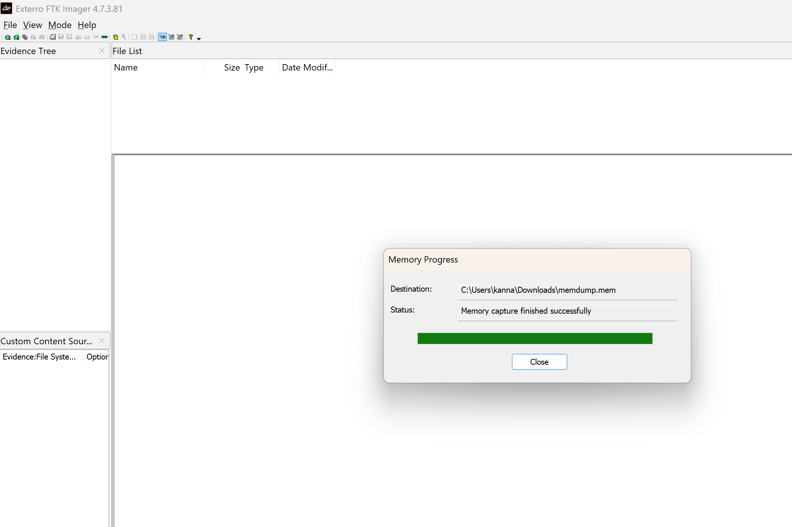

# Ex.No.1 — FTK Imager: Forensic Imaging Tool

## Volatile Memory (RAM) Capture

**Step 1:** Run FTK Imager
Right-click the FTK Imager icon → Run as administrator.

**Step 2:** Capture Memory
Go to File → Capture Memory…
Choose a destination folder on an external drive.
Give the file a descriptive name if needed.

**Step 3:** Start and Complete Capture
Click Capture Memory.
Wait for the progress bar to finish.
A memory dump file (.mem or .bin) will be saved.

## Non-Volatile Memory (Disk Imaging)

**Step 1:** Start Disk Imaging
Open FTK Imager as administrator → File → Create Disk Image…

**Step 2:** Select Source
Choose Physical Drive (entire disk) or Logical Drive (specific partition).
Connect the disk via a write-blocker to prevent modifications.

**Step 3:** Configure Destination
Click Add… → select Image Type:
E01: Compressed, includes metadata (recommended)
Raw (DD): Bit-for-bit copy, no compression
Select a folder on an external drive.
Fill in case details (examiner name, case number).

**Step 4:** Start Imaging and Verify
Check Verify images after creation and Calculate MD5/SHA1 hash.
Click Start → wait until imaging is complete.

**Step 5:** Completion
FTK Imager will display hash verification.
Save the acquisition log to document evidence integrity.

# OUTPUT:

