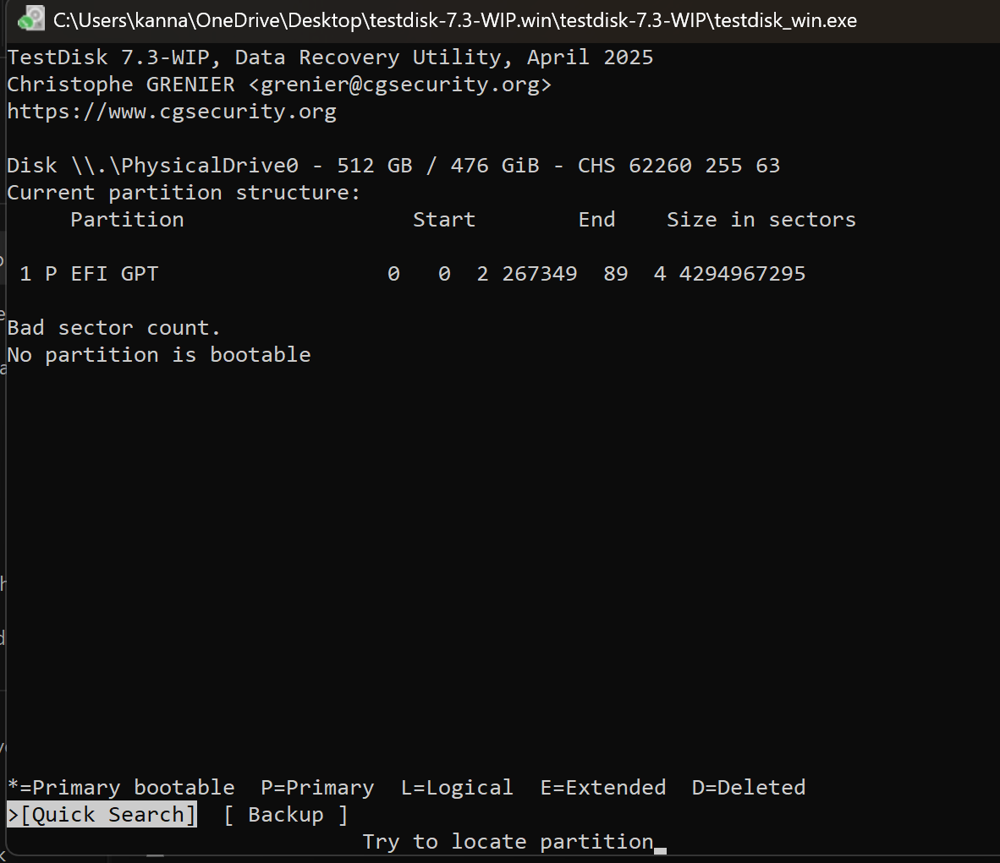

# Ex.No.— Recovering Lost Data Using TestDisk

**Step 1:** Download and Launch
Download TestDisk from https://www.cgsecurity.org/
.
Extract the ZIP and open testdisk_win.exe (no installation required).

**Step 2:** Create Log File
Options:
Create → new log (recommended)
Append → add to existing log
No Log → skip logging
Select Create → Press Enter.

**Step 3:** Select Disk
TestDisk lists all drives.
Use arrow keys to select the affected disk → Press Enter.

**Step 4:** Partition Table
Usually Intel/PC for Windows (auto-detected).
Press Enter to confirm.

**Step 5:** Analyze Disk
Select Analyse → Press Enter.
Press Quick Search to find lost partitions.
Use Deeper Search if needed for a thorough scan.

**Step 6:** Review and Recover Files
Highlight a partition → Press P to list files.
Select files/folders → Press C to copy.
Choose a folder on a different drive → Press C again to save.

**Step 7:** Exit
After recovery, exit TestDisk.
Verify the recovered files in the destination folder.

# OUTPUT:

