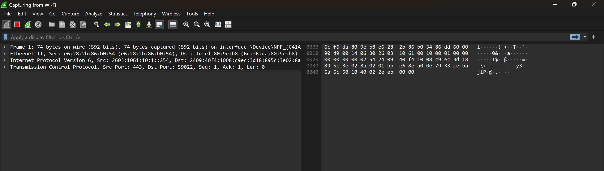
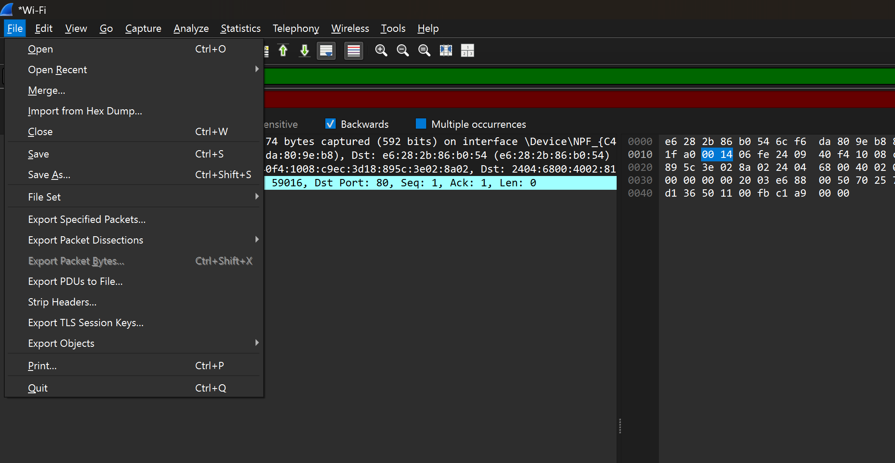

# Ex.No.3 — Wireshark: Network Packet Capture and Analysis

**Step 1:** Launch Wireshark
Right-click the Wireshark icon → Run as administrator.

**Step 2:** Choose Network Interface
On the home screen, select the network interface you want to monitor (e.g., Wi-Fi or Ethernet).
Double-click to start capturing packets.

**Step 3:** Capture Packets
Wireshark records live network traffic immediately.
The main window shows packet list, details, and hex view in real time.

**Step 4:** Apply Filters (Optional)
Use display filters to focus on specific traffic:
ip.addr == 192.168.1.10 → traffic to/from a host
http → only HTTP packets
tcp.port == 80 → traffic on port 80
Enter the filter in the Display Filter bar and press Enter.

**Step 5:** Stop and Save Capture
Click the Red Square (Stop) button when done.
Save the capture: File → Save As… → .pcapng format. Store it in a case folder or external drive.

**Step 6:** Analyze Packets
Click a packet to view details.
Expand sections like Ethernet, IP, TCP/UDP, Application layer.
Follow conversations: Right-click → Follow → TCP Stream to see full chats or requests.

**Step 7:** Export Data (Optional)
Go to File → Export Objects → HTTP / FTP / DICOM to extract files, images, or sessions from captured traffic.

# OUTPUT:

