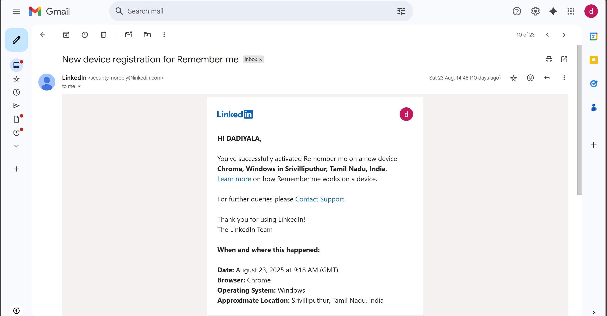
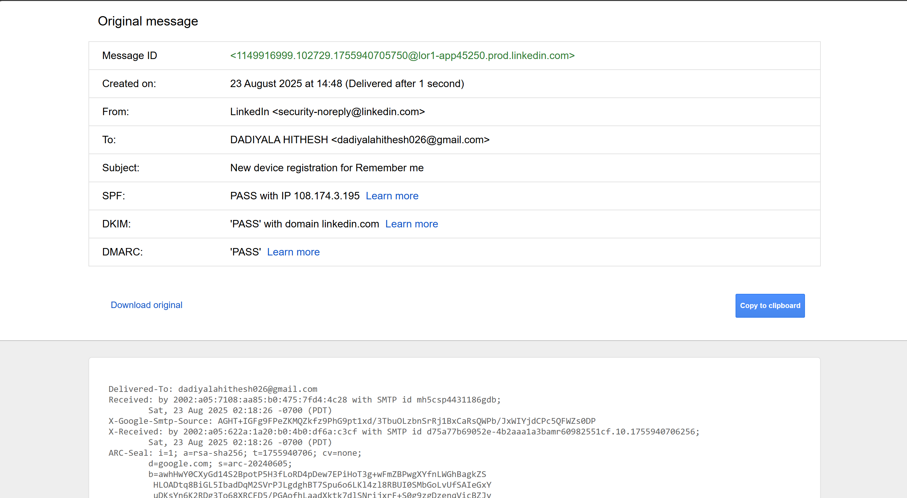
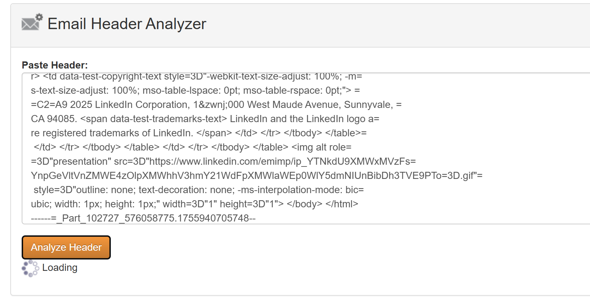
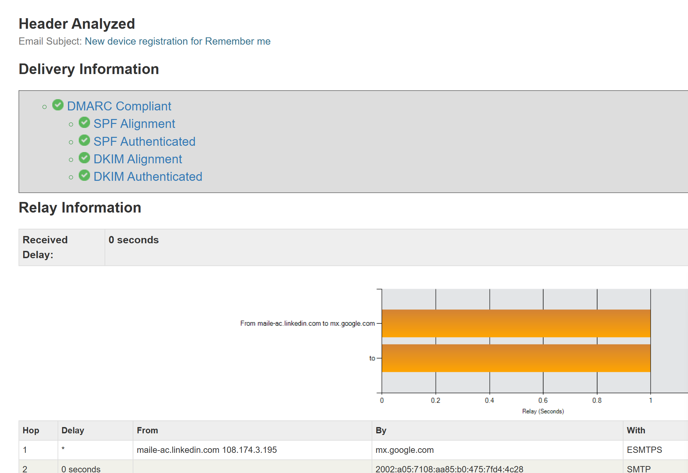
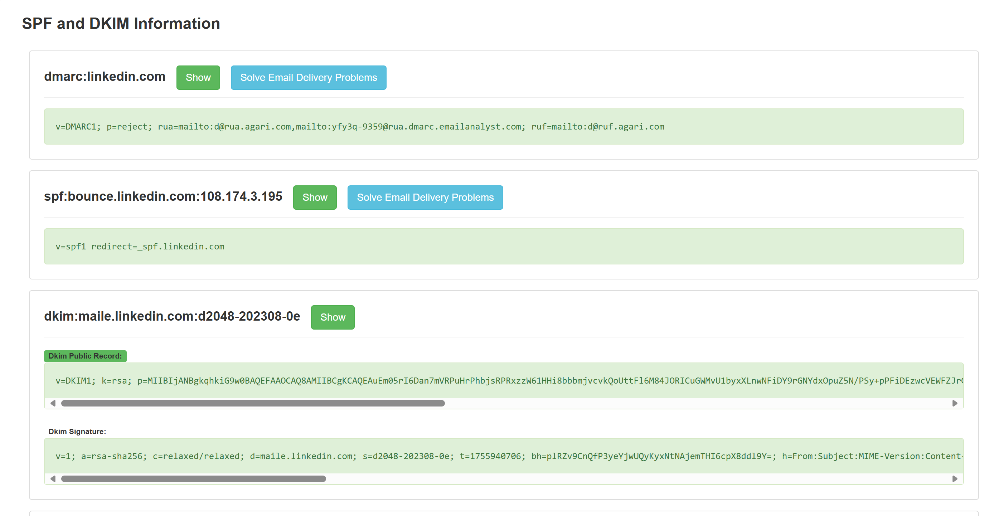
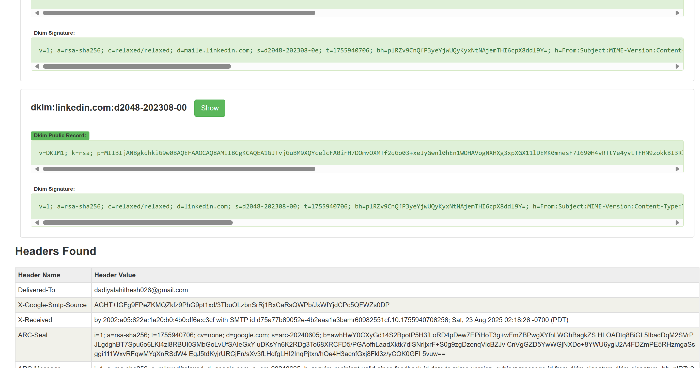

# Ex.No.4 MHA (Mail Header Analyzer)

**Step 1:** Access the MHA Tool
Launch a web browser.
Visit any Mail Header Analyzer site (for example: https://mha.azurewebsites.net/
 or another available analyzer).

**Step 2:** Collect the Email Heade
Open the email you want to investigate.
Locate the complete header details (not just subject or body).
In Gmail → Click the three dots (⋮) → Show Original → Copy everything.
In Outlook → Open the mail → File → Properties → Under Internet headers, copy all the text.

**Step 3:** Insert Header into the Analyzer
Go back to the MHA tool.
Paste the copied header into the input field.
Ensure the header includes details like Received, From, To, Message-ID, Return-Path, etc.

**Step 4:** Run the Analysis
Click the Analyze/Submit button.
The tool will process the header and show information such as:
IP address of the original sender
List of servers the message passed through
Results of SPF, DKIM, and DMARC checks
Approximate location of the sender’s IP (if found)
Any irregularities or signs of spoofing

**Step 5:** Review the Findings
Follow the Received headers to trace the actual source.
Confirm the legitimacy of the sender by checking authentication results (SPF/DKIM/DMARC).

# output:

